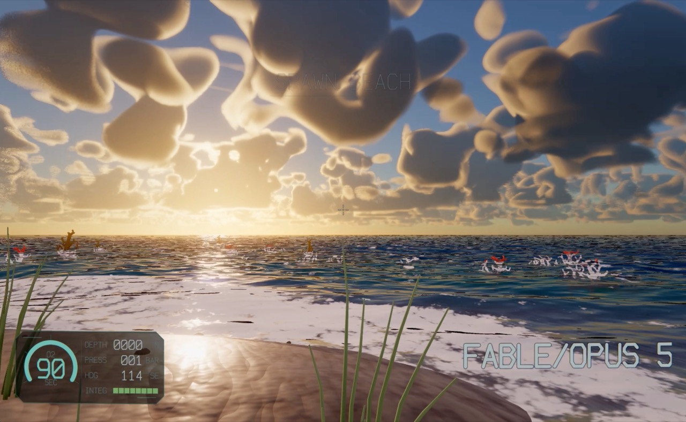
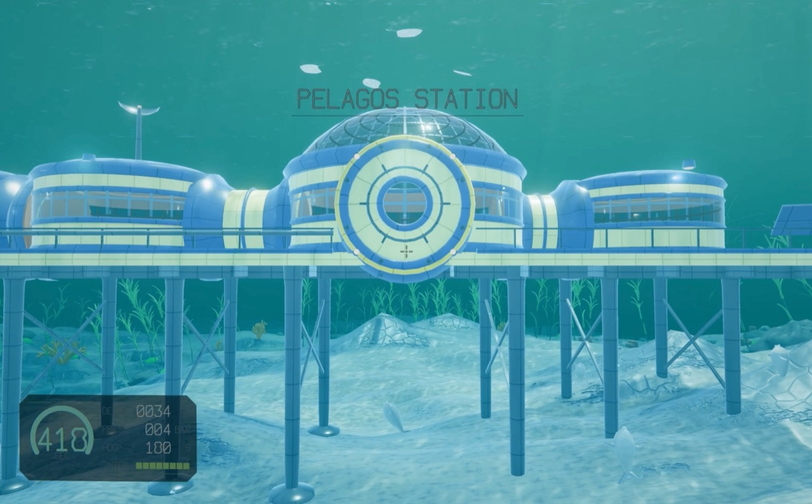
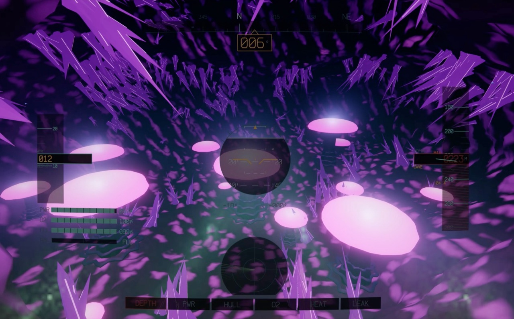
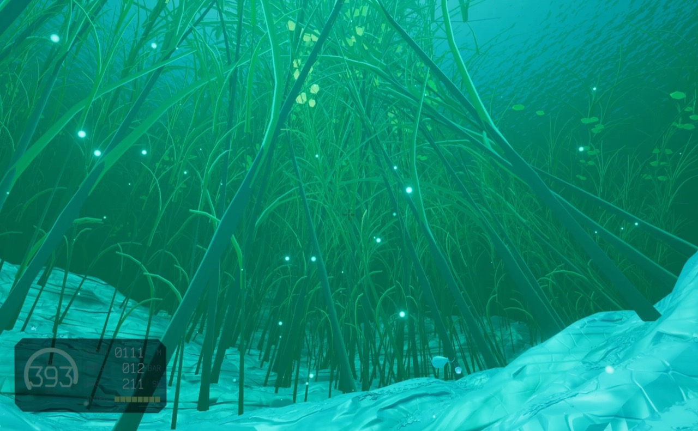

# SUBWAVE

A browser-native exploration/survival game in the vein of Subnautica, rendered
entirely with WebGPU. You wake up on a beach, board a hybrid aerodyne/submersible,
fly it over the ocean, then aim down and dive — the world goes from sunlit reefs to
bioluminescent caves and an abyss 1131 m deep. It runs at 120 fps in Chrome.

Built with [Claude Code](https://claude.com/claude-code) using Opus 5 and
Fable 5, with ultracode multi-agent orchestration doing the bulk of the work.

|  |  |
|:--:|:--:|
|  |  |

Everything is built from scratch:

- **Zero dependencies.** `package.json` declares nothing. No npm packages, no CDN,
  no build step — the browser loads the ES modules straight from `src/`.
- **All art is procedural.** Terrain, creatures, the vessel, habitats and plants
  are generated in code; textures come from noise; shaders are hand-written WGSL.
- **A full ocean simulation.** FFT wave spectrum, atmosphere LUTs, volumetric
  water with physically-grounded light attenuation, caustics, cascaded shadow
  maps, TAA and an AgX tonemapping pipeline.
- **A living world.** Distinct biomes with their own water colour and flora,
  cave systems, creatures with residency behaviour, and staged deep encounters.

## Running it locally

Requirements: a recent [Chrome](https://www.google.com/chrome/) (WebGPU is
required — there is no WebGL fallback) and [Node.js](https://nodejs.org/) for the
dev server.

```bash
node server.mjs          # serves on http://127.0.0.1:8080
```

Open <http://127.0.0.1:8080> in Chrome and click to grab the pointer.

## Controls

An on-screen legend always shows the keys that work in your current context
(walking, swimming, flying, diving). The essentials:

| Key | Action |
|---|---|
| Mouse | Look / aim |
| `W A S D` | Move |
| `Shift` | Sprint |
| `Space` / `Ctrl` | Up / down (swimming) |
| `E` | Board the vessel |
| `F` | Flashlight on foot · exit the vessel |
| `L` | Vessel exterior lights |
| `Y` | Toggle cockpit / chase camera |
| `G` | Play the scripted showcase demo |
| `Esc` | Release the cursor |

Diving the vessel has no dedicated key: aim down and open the throttle — the
flight computer handles the transition into the water.

## Development

The verification suite lives in `tools/` (offline tests plus headless-Chrome
harnesses). Start with:

```bash
node tools/check.mjs     # syntax, imports, WGSL includes
node tools/qa.mjs        # boots the game and screenshots key scenarios
```

`CLAUDE.md` documents the project-wide invariants; each source file documents its
own contracts in place.

## License

See [LICENSE](LICENSE).
